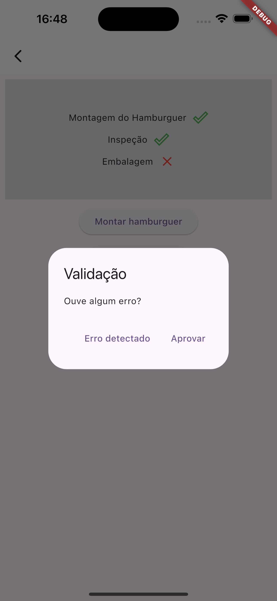

# hamburguer_factory

Este aplicativo foi feito para apresentação o funcionamento de um automato

## Descrição do Automato

...

## Layouts

   

## GIF

#### O que já foi feito?
- [X] Telas;
- [X] Funcionamento do Automato.

### Tecnologias utilizadas
- ``VSCode``
- ``Dart``
- ``Flutter``
- ``XCode = Emulador de IOs``
- ``Android Studio = Emulador Android``
- ``iPad = iPadOS``